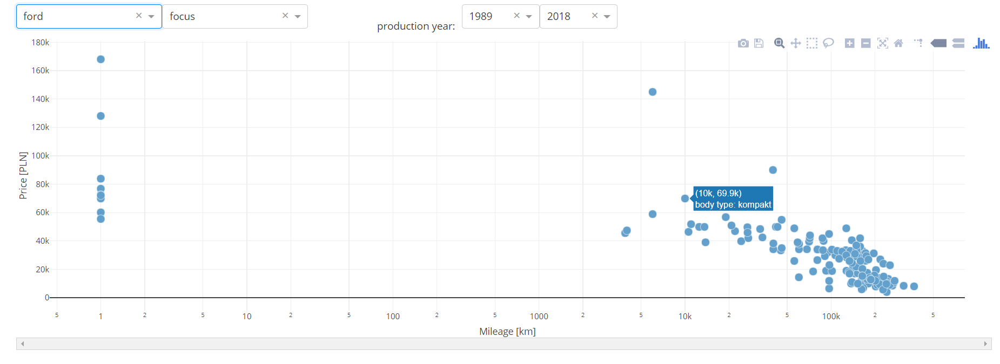
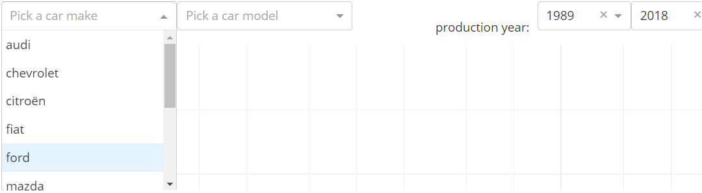
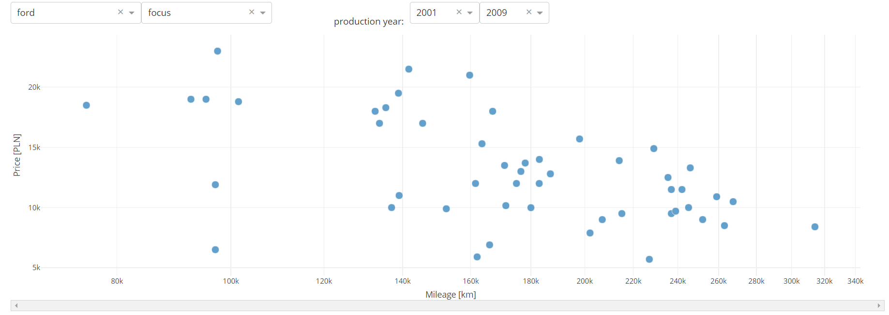

# Car prices

Dash app plotting car prices and mileage from polish service with car ads [OTOMOTO](https://www.otomoto.pl/). 

## Built With

* [Python](https://www.python.org/)
* [Dash](https://dash.plot.ly/)
* [Requests](http://docs.python-requests.org/en/master/)
* [BeautifulSoup](https://www.crummy.com/software/BeautifulSoup/)

## Version

0.8

## Features
* Choosing car model and make 

* Choosing range of production years

* graphing data on scatter plot
* updating data without page refreshing

## TODO
* Scraping all car models
* Enabling data update (starting a scraping process) from plot site

## Author
* [Kamil Kwapisz](https://github.com/KamilKwapisz)

## License

This project is licensed under the MIT License - see the [LICENSE.md](LICENSE) file for details
